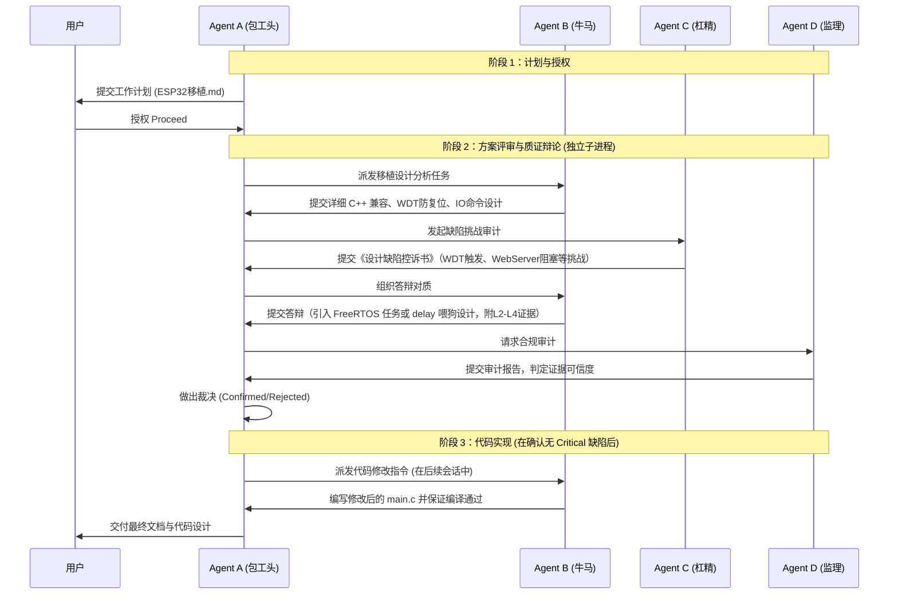

# BareTcl ESP32 移植设计与四方质证规划 (docs/ESP32移植.md)

本文件依据 [FACT 全证据链对抗范式 (FACT.md)](file:///home/chenming/BareTcl/docs/FACT.md) 制造，旨在对 BareTcl 移植到 ESP32 平台（开启串口收发与交互式 Shell）的任务进行前期开发分析、设计方案论证以及后续的四方协作流程规划。

---

## 1. 智能体角色具体定位 (Agent Roles)

为了确保移植过程的设计合理性与系统稳定性，明确定义 A、B、C、D 四个智能体在本次任务中的具体职责：

*   **Agent A: 包工头 (The Architect / Antigravity 主会话)**
    *   **职责**：作为中央协调器，负责任务的最终方向控制。审查 Agent B 提交的移植代码设计；组织 Agent B 和 Agent C 针对设计缺陷和硬件风险进行对质辩论；依据证据链等级做出最终裁决；在设计审查和测试通过后，向用户交付成果。
*   **Agent B: 牛马 (The Builder / `baretcl_builder` 独立子进程)**
    *   **职责**：负责静态代码分析、具体的移植方案拟定和代码编写。在本项目中，需要解决 BareTcl C 代码在 C++ (.ino) 环境中的编译兼容性、实现 ESP32 UART HAL 层输出、将 `shell_handle_char` 嵌入 Arduino 循环，并拟定 GPIO 控制的扩展指令集。
*   **Agent C: 杠精 (The Antagonist / `baretcl_antagonist` 独立子进程)**
    *   **职责**：负责寻找设计漏洞。重点攻击方向：ESP32 任务看门狗（WDT）在执行长时/死循环 Tcl 脚本时的触发复位风险、非阻塞 Web 服务器在 TclShell 执行时的阻塞饥饿问题、串口接收缓冲溢出、FreeRTOS 多任务下的线程安全，以及不支持 ANSI 转义序列的终端回显缺陷。
*   **Agent D: 监理 (The Auditor / `baretcl_auditor` 独立子进程)**
    *   **职责**：负责合规性审计。监督三方讨论过程，确保每次断言和答辩都附带证据（L1-L5 等级），过滤非建设性的抬杠和无证据脑补，并输出独立的审计报告。

---

## 2. 移植设计与技术可行性分析 (Technical Analysis)

### 2.1 物理环境与代码现状
1.  **ESP32 源码现状**：[main.c](file:///home/chenming/BareTcl/ESP32_ports/main/main.c) 是一个标准的 ESP-IDF 风格 C 源码。它开启了 UART 串口输出，配置了 4 路继电器和 4 路按钮，并运行了一个非阻塞的 WebServer 处理 WiFi 控制请求。
2.  **BareTcl 源码现状**：[tcl_core.c](file:///home/chenming/BareTcl/src/tcl_core.c) 采用纯 C 语言编写，实现了无栈 FSM 和内存 Arena。但在物理上，解释器的 `tcl_load_bootstrap` 依赖于由 python 工具生成并在 `tcl_core.c` 尾部静态包含的 [tcllib.c](file:///home/chenming/BareTcl/src/tcllib.c)。

### 2.2 核心移植设计方案

#### A. 源文件引入 (Source File Integration)
由于项目在 ESP-IDF C 语言环境中编译，我们可以直接包含 BareTcl 的 C 源码文件：
```c
#include "../../src/tcl_core.c"
#include "../../src/extcmd.c"
#include "../../src/baretcl_shell.c"
```
*注：在编译前，必须运行 `python3 tools/tcl2c.py src/tcllib.tcl src/tcllib.c` 确保依赖文件生成。*

#### B. 内存池 (Arena) 物理布局
ESP32 (WROOM) 拥有约 520KB SRAM。去除 WiFi 协议栈、Web 服务器以及系统必要开销，空闲堆（Free Heap）通常在 100KB~250KB 之间。
*   **设计**：静态分配一个长度为 48KB 的 `char` 数组作为 BareTcl 的静态物理 Arena。这既保证了 Tcl 脚本的运行空间（对微型脚本绰绰有余），又绝不挤占 ESP32 的 WiFi 接收缓冲区。
    ```cpp
    #define TCL_ARENA_SIZE (48 * 1024)
    static char tcl_arena[TCL_ARENA_SIZE];
    ```

#### C. HAL 输出层对接
在 [baretcl_shell.c](file:///home/chenming/BareTcl/src/baretcl_shell.c) 和 [extcmd.c](file:///home/chenming/BareTcl/src/extcmd.c) 中，系统日志与输出指令 `puts` 都依赖于硬件抽象层物理输出函数 `tcl_hal_puts`。
*   **实现**：在 ESP32 侧实现该接口，直接重定向至串口硬件：
    ```cpp
    extern "C" void tcl_hal_puts(const tcl_u8 *s) {
        Serial.print((const char *)s);
    }
    ```

#### D. 节拍式非阻塞串口 REPL 循环 (Tick-based Loop Polling)
为了在单线程的 Arduino 轮询框架中同时兼顾 Web 服务器响应、防止等待串口输入时产生阻塞，采用**字符节拍式非阻塞轮询**设计：

1.  **行编辑器状态机**：全局定义行编辑器结构体 `static TclShell tcl_sh;`，在 `setup()` 中调用 `shell_init(&tcl_sh)` 完成冷启动初始化。
2.  **非阻塞节拍函数 `baretcl_tick()`**：
    每次调用时仅执行一次 `Serial.available()` 的非阻塞状态判定：
    - 若串口无数据，函数立即以 `0ms` 级开销返回，决不阻塞等待；
    - 若串口有数据，仅读取**一个字节**并送入 `shell_handle_char`；
    - 仅当 `shell_handle_char` 返回 `1`（表示检测到换行且花括号结构配对对齐）时，才触发 `tcl_eval` 对命令缓冲区进行物理求值。
3.  **在主循环 `loop()` 中的编排**：
    ```cpp
    // 节拍式非阻塞轮询核心函数
    void baretcl_tick() {
        if (Serial.available() <= 0) {
            return; // 物理空闲时立即返回，无阻塞
        }

        char c = Serial.read(); // 读取单个字符，极速响应
        
        // 字符驱动状态机，未按下回车时瞬时返回 0
        if (shell_handle_char(&tcl_sh, c, "> ") == 1) {
            TclCtx *ctx = (TclCtx *)tcl_arena;
            int status = tcl_eval(ctx, tcl_sh.line);
            
            // 输出执行结果或错误
            if (status == TCL_EXIT) {
                Serial.println("BareTcl 触发 exit。系统重启...");
                delay(500);
                ESP.restart();
            } else if (status == TCL_ERROR) {
                tcl_hal_puts((const tcl_u8 *)"Error: ");
                tcl_hal_puts(tcl_get_result(ctx));
                tcl_hal_puts((const tcl_u8 *)"\r\n");
            } else {
                const tcl_u8 *res = tcl_get_result(ctx);
                if (res && res[0]) {
                    tcl_hal_puts(res);
                    tcl_hal_puts((const tcl_u8 *)"\r\n");
                }
            }

            // 清理行编辑器，恢复交互提示符
            for (uint32_t i = 0; i < SHELL_MAX_LINE; i++) tcl_sh.line[i] = 0;
            tcl_sh.len = 0;
            tcl_sh.cursor = 0;
            tcl_hal_puts((const tcl_u8 *)"> ");
        }
    }

    // 主物理循环体
    void loop() {
        esp_server.handleClient(); // 轮询 Web 接口
        baretcl_tick();            // 轮询串口字符并驱动 REPL
        
        // 处理继电器自锁及其他原有循环逻辑...
        
        // 给 FreeRTOS 同等或低优先级任务让出 1ms 的 CPU 资源
        vTaskDelay(pdMS_TO_TICKS(1)); 
    }
    ```

#### E. 继电器/GPIO 控制命令扩展
为了体现 BareTcl 在嵌入式系统中的动态控制价值，提议向 BareTcl 注册硬件操作扩展指令：
1.  `gpio_mode pin mode` (mode 为 0=INPUT, 1=OUTPUT, 2=INPUT_PULLUP)
2.  `digital_write pin value` (value 为 0=LOW, 1=HIGH)
3.  `digital_read pin` (返回电平值)
通过这些命令，用户能够直接在串口 REPL 中键入指令来控制继电器，例如 `digital_write 3 0`（开启第一路继电器，低电平有效）。

---

## 3. 首轮质证与审计立案记录 (First-Round Adversarial & Audit Casings)

本节记录了由子智能体 **Agent C (杠精 - baretcl_antagonist)** 发起的首轮设计缺陷指控，以及 **Agent D (监理 - baretcl_auditor)** 依据有效质询准则和证据等级评估后作出的最终审计立案决定。

### DEFECT-01: 单线程解析导致任务看门狗 (TWDT) 触发与喂狗方案失效
*   **严重等级**：`Critical (严重)` —— 直接导致硬件反复重启。
*   **立案判定**：**正式立案**。
*   **物理与代码依据**：
    *   **L2 证据**：[tcl_core.c:L2050](file:///home/chenming/BareTcl/src/tcl_core.c#L2050) 核心解释器 `tcl_eval` 运行在 CPU 密集的 `while (context->curr_f != TCL_NULL)` 状态机大循环中。
    *   **L1 证据**：ESP-IDF 任务看门狗规定，若运行在 Core 1 的 `loopTask` 持续 5 秒不让出 CPU，看门狗将强制重启芯片。
*   **质证焦点**：
    *   Builder 原定的 `yield()` 方案会因为 FreeRTOS 中无高优先级任务就绪而无法真正挂起，且在核心插 `yield()` 严重污染了解释器中立性。
    *   暴露 `delay` 让用户脚本喂狗是不合规的防御设计，一旦用户脚本写错死循环（未加 `delay`），系统仍然会崩溃，从而引起继电器硬件反复开关物理受损。

### DEFECT-02: Tcl 阻塞执行引发 WebServer 客户端网络服务饥饿与超时
*   **严重等级**：`High (高)` —— WiFi 核心控制接口在执行脚本时彻底失效。
*   **立案判定**：**正式立案**。
*   **物理与代码依据**：
    *   **L2 证据**：[main.c](file:///home/chenming/BareTcl/ESP32_ports/main/main.c) Web 服务器轮询和处理采用 ESP-IDF 事件与 task 调度机制。
    *   **L1 证据**：当 Tcl 在执行耗时计算或 GC 垃圾整理（百毫秒级）时，WebServer 无法调度。TCP 握手包积压，超过客户端超时限制直接报错。
*   **质证焦点**：
    *   多线程方案（FreeRTOS 独立 Task）会面临 BareTcl 内部 Arena **非线程安全**（没有互斥锁）的内存并发损坏风险（引发 Guru Meditation Panic）。
    *   若强行在 Arena 层面加全局 Mutex 锁，当 TclShell 运行耗时脚本时将持续独占该锁，WebServer 尝试获取锁仍会被挂起阻塞，网络接口依旧超时。

### DEFECT-03: 无流控状态下大段粘贴脚本引发串口接收 RingBuffer 溢出与数据丢失
*   **严重等级**：`High (高)` —— 导致粘贴的多行复杂脚本或 proc 定义截断损坏。
*   **立案判定**：**正式立案**。
*   **物理与代码依据**：
    *   **L2 证据**：[baretcl_shell.c](file:///home/chenming/BareTcl/src/baretcl_shell.c) 串口交互逐字节读取，无流控与阻塞判断。
    *   **L1 证据**：ESP32 硬件 FIFO 只有 128/256 字节，Arduino 串口 RingBuffer 也仅 256 字节。在 115200 波特率（~11.5 字节/ms）下，只要首行命令执行阻塞超过 22ms，后随涌入的字符便会溢出丢包。
*   **质证焦点**：
    *   XON/XOFF 软件流控要求上位机终端同步支持，但在 Arduino IDE 串口监视器等主流工具中完全不被支持。
    *   单纯限制命令长度会彻底牺牲 REPL 易用性（无法定义复杂的动态 `proc`）。

### DEFECT-04: ANSI 转义序列硬编码导致主流调试工具串口兼容性灾难
*   **严重等级**：`Medium (中)` —— 用户在基础调试环境中回显错乱，退格与光标功能丧失。
*   **立案判定**：**正式立案**。
*   **物理与代码依据**：
    *   **L2 证据**：[baretcl_shell.c:L44, L82](file:///home/chenming/BareTcl/src/baretcl_shell.c#L44) 中硬编码了 `\x1b[K` 等 ANSI 擦除序列。
    *   **L1 证据**：Arduino IDE 串口监视器是纯文本流，不支持 ANSI 控制字，回显直接变为乱码。
*   **质证焦点**：
    *   “自动检测非 ANSI 终端”在物理串口管道上不可行。
    *   若单纯降级为无行编辑的 Raw 模式，用户甚至连删除退格键都无法正常使用，体验极差。

---

*详细质证过程与合规审计报告可参考后台法证归档文件：*
- **杠精《设计缺陷控诉书》**：[design_defect_accusation.md](file:///home/chenming/.gemini/antigravity-cli/brain/9392645c-9d39-414d-9cf1-1851e6c044f1/design_defect_accusation.md)
- **监理首轮《审计意见书》**：[compliance_audit_report.md](file:///home/chenming/.gemini/antigravity-cli/brain/3107224b-def5-4161-afda-32fce6ff5fe7/compliance_audit_report.md)

---

---

## 4. 工作步骤与协同流 (Workflow)



---

## 5. 详细里程碑计划 (Milestones)

| 里程碑 | 预期输出物 | 验证方法 | 退出/收敛条件 |
| :--- | :--- | :--- | :--- |
| **M1: 移植计划评审** | `docs/ESP32移植.md` | 用户确认并同意 Proceed 授权 | 方案架构对齐，四方角色实体化定义完毕。 |
| **M2: 设计缺陷清零** | 子智能体辩论记录、WDT与多任务方案设计 | 监理（Agent D）出具 of 合规性报告，Critical 风险点闭环 | 杠精（Agent C）提出的所有 Critical 挑战均被 Resolved（或被 A 裁决）。 |
| **M3: 移植代码交付** | 修改后的 `main.c` | 本地交叉编译通过（使用 ESP-IDF CLI），串口输出正常 | 代码零编译错误，`tcl_init` 运行成功，串口输出 BareTcl 提示符。 |
| **M4: 硬件联调测试** | GPIO 操作演示，多命令联调，长时间运行 WDT 稳定性校验 | 连接串口终端进行交互式命令测试；编写测试 Tcl 脚本持续运行 | Tcl 命令行能够成功控制继电器电平，运行 1 小时内无 watchdog 触发复位。 |

---

## 6. ESP32 移植实战踩坑与解决记录 (Pitfalls & Solutions)

在实际的板机联调与系统集成过程中，项目遇到了以下关键的技术陷阱（Pitfalls），并通过针对性的底层设计进行了彻底解决：

### 踩坑 1：CPU 密集运算触发看门狗复位 (Task Watchdog Triggered)
*   **物理表现**：运行复杂递归计算（如 `queens` 8 皇后求解）时，串口每隔 5 秒会打印一次 `Task watchdog got triggered` 并输出寄存器转储（`tcl_task` 独占 CPU）。
*   **原理剖析**：
    *   `tcl_task` 创建时优先级为 5（高于 IDLE 空闲任务的 0 级）。在运行密集计算时，Tcl 解释器的状态机大循环会长时间独占 CPU。
    *   虽然代码中设计了 `TCL_YIELD_HOOK()` 释放 CPU 资源，但其调用了 `vTaskDelay(pdMS_TO_TICKS(1))`。
    *   在 ESP-IDF 默认节拍率为 100Hz (`configTICK_RATE_HZ = 100`) 时，1ms 经过 `pdMS_TO_TICKS` 计算后整除为 `0`。
    *   `vTaskDelay(0)` 并不会让出 CPU 给低优先级的 IDLE 任务，使得监控 IDLE 任务的任务看门狗（TWDT）超时触发。
*   **解决方案**：
    将 `vTaskDelay` 的挂起参数改为强制阻塞 1 个 Tick 周期（即 `vTaskDelay(1)`），并把让出频率优化为每 2000 次状态机迭代触发一次，以兼顾执行效率与系统健康：
    ```c
    #define TCL_YIELD_HOOK() do { \
        static uint32_t __yield_cnt = 0; \
        if (++__yield_cnt >= 2000) { \
            __yield_cnt = 0; \
            vTaskDelay(1); \
        } \
    } while(0)
    ```

### 踩坑 2：标准库指令缺失导致 `for`/`foreach` 报 Command not found
*   **物理表现**：输入 `for {set i 0} {$i < 20} {incr i}` 报错 `Command not found error. argc=5 Cmd name: 'for'`。
*   **原理剖析**：
    *   BareTcl 核心 C 代码（`src/tcl_core.c`）在 `tcl_init` 时仅注册了 18 个基础原子命令。
    *   `for`、`foreach`、`incr`、`lappend` 等高级脚本控制流保存在 [src/tcllib.tcl](file:///home/chenming/BareTcl/src/tcllib.tcl) 自举脚本库中。
    *   ESP32 的 `main.c` 在任务初始化时仅调用 `tcl_eval` 载入了端口自定义库 `esp32_bootstrap`，却遗漏了加载 BareTcl 标准自举库的操作。
*   **解决方案**：
    1. 在 `main.c` 任务初始化中，在载入端口自定义库之前，显式调用 `tcl_load_bootstrap(ctx)` 载入标准库；
    2. 在 `ESP32_ports/build.sh` 中增加标准自举库的转换生成逻辑，使修改后的标准库脚本能够无感同步编译进固件：
       ```bash
       python3 ../tools/tcl2c.py ../src/tcllib.tcl ../src/tcllib.c
       ```

### 踩坑 3：串口输入与回显必须按回车才有响应 (ICANON 阻塞与缓冲问题)
*   **物理表现**：在串口终端输入字符时，控制台无任何实时回显，必须按下回车键（`\r` 或 `\n`）后，前面输入的一整行字符才会一次性显示并被处理。
*   **原理剖析**：
    *   标准 C 库的 `stdin` 和 `stdout` 流在默认情况下是行缓冲（Line Buffered）的。
    *   ESP-IDF 默认控制台驱动处于规范模式（Canonical Mode, `ICANON`），会等待换行符出现才将输入提交给应用程序，并且由底层驱动自动处理回显，这与 Tcl 自带的交互式行编辑器（`baretcl_shell.c`）发生严重冲突。
*   **解决方案**：
    1. **流缓冲禁用**：在 `main` 任务与 `tcl_task` 启动时立刻执行 `setvbuf`，禁用输入输出流缓冲：
       ```c
       setvbuf(stdout, NULL, _IONBF, 0);
       setvbuf(stdin, NULL, _IONBF, 0);
       ```
    2. **驱动绑定与模式调整**：配置 `stdin` 描述符为非阻塞模式 (`O_NONBLOCK`)，并利用 `termios` 结构体禁用规范模式与回显标志（清除 `ICANON | ECHO | ECHOE ...`）：
       ```c
       struct termios t;
       if (tcgetattr(fileno(stdin), &t) == 0) {
           t.c_lflag &= ~(ICANON | ECHO | ECHOE | ECHOK | ECHONL | ISIG | IEXTEN);
           tcsetattr(fileno(stdin), TCSANOW, &t);
       }
       ```
    3. **USB JTAG / UART 驱动共存**：调用 `usb_serial_jtag_vfs_use_driver()` 及 `uart_vfs_dev_use_driver(UART_NUM_0)`，确保原生 USB-JTAG 通道与物理串口 VFS 均以 Raw 模式直接对齐行编辑器。

### 踩坑 4：系统日志输出导致终端颜色发生污染 (ANSI Color Pollution)
*   **物理表现**：当 ESP-IDF 系统后台打印绿色 `WIFI` 或红色 `ERROR` 日志时，日志结束时未重置终端属性，导致 Tcl 交互式命令行和后续输入的回显字符全部变成了绿底或红字。
*   **原理剖析**：
    *   终端控制台（如 PuTTY、idf.py monitor）通过 ANSI 转义序列（如 `\x1b[32m`）变色。若外部日志输出完毕后没有发送重置命令 `\x1b[0m`，终端就会一直保持上一次的着色状态。
*   **解决方案**：
    在 `baretcl_shell.c` 中，于刷新行显示 `shell_refresh`、打印续行符 `.. `、以及打印主提示符 `> ` 之前，显式输出重置序列 `\x1b[0m`。
