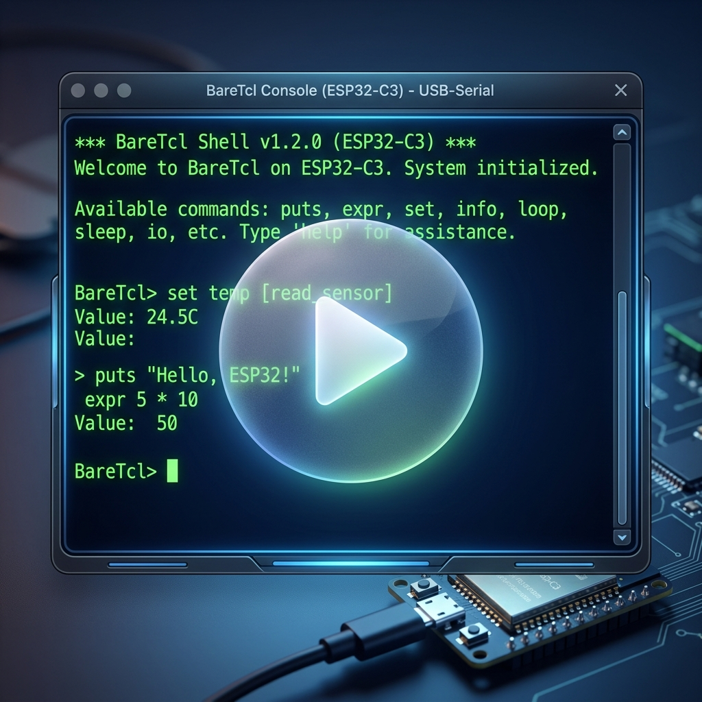

# BareTcl

**A highly compact Tcl interpreter core designed for minimal resources, rapid porting, and bare-metal execution.**

BareTcl is more than just an interpreter; it is a bare-metal Tcl Shell. It is designed to completely liberate you from tedious serial communication logic, manual protocol parsing, and fragile ad-hoc state machines. BareTcl provides a near "zero-cost" dynamic scripting integration experience for bare-metal systems.

[中文版](../README.md) | [日本語版](./README.ja.md)

---

## Zero-Dependency, Built from Scratch

Many engines labeled as "embedded" (such as Lua or JavaScript) are often an unrealistic fantasy for true bare-metal porting. They typically depend on standard Libc (e.g., `malloc`/`free`), OS scheduling, or complex floating-point libraries. For most developers, porting them to resource-constrained bare-metal hardware is an immense task that rarely succeeds. Those "embedded" solutions requiring Libc are not truly low-level embedded.

BareTcl is highly portable because it avoids external libraries. To ensure stability on bare-metal, we implemented everything ourselves, imposing **almost no requirements** on your system:

- **No `malloc` / No `free`**: Fully based on a fixed-size static Arena memory pool. Completely eliminates the risk of heap fragmentation.
- **No `libc`**: Pure, independent C code. No dependency on `<stdio.h>`, `<string.h>`, or any standard library headers.
- **No C Stack Support**: Fully stackless Finite State Machine (FSM) architecture. No matter how deep the recursion is in the Tcl script, it will **never** cause a C language call stack overflow.
- **No `setjmp` / `longjmp`**: Deterministic control flow without reliance on complex jumping mechanisms.
- **No Complex Build**: Single-file core, supports compilation with `-ffreestanding -nostdlib`.

---

## Why Choose BareTcl? (Say Goodbye to Boring Development)

For decades, embedded developers have been forced to repeatedly write dull serial command parsers. BareTcl puts an end to this.

By integrating BareTcl, you can transform an ordinary serial port into a powerful dynamic console. You no longer need to hard-code parsing logic for every feature; instead, you can execute complex Tcl logic, loops, and conditionals directly at runtime. It is a true **Embedded Swiss Army Knife**, instantly giving static MCUs flexible programming capabilities.

---

## Core Features

- **Industrial-Grade Reliability**: Built specifically for mission-critical systems with a strict zero-dependency strategy.
- **Smart Interactive Shell**: Built-in lightweight line editor supporting backspace, arrow key cursor movement, history of the last 16 commands, and intelligent multi-line input (auto-identifying unclosed braces).
- **Atomic 18-Instruction Core**: The C core contains only 18 atomic instructions. All high-level logic (such as `for`, `incr`, `foreach`) is implemented via Tcl script bootstrapping.
- **Compacting GC**: Utilizes a moving/compacting garbage collector to ensure the Arena space remains fragment-free even under thousands of object turnovers.
- **Bit-Level Determinism**: Strictly uses fixed-width types like `tcl_i32` and `tcl_u8` to ensure consistent behavior across platforms.

---

## Powerful Performance & Reliability Verification

- **Self-Bootstrap Completeness**: The core instruction set is highly complete, and the standard library is built entirely by Tcl itself and statically integrated.
- **8-Queens Solver**: Runs the 8-Queens algorithm perfectly in a bare-metal environment, proving its ability to handle deep recursion and complex lists.
- **GC Extreme Pressure**: Withstood tens of thousands of variable churn tests in an Arena space of only 64KB, with zero leaks and zero fragmentation.
- **Native ESP32 Chip Porting**: Fully functional native C porting on ESP32-C3 using ESP-IDF (see [ESP32_ports](file:///home/chenming/BareTcl/ESP32_ports)). Features a non-blocking serial REPL, VFS unbuffered real-time input, safe task yielding (`TCL_YIELD_HOOK`) to satisfy hardware/software watchdog timers, and C extension bindings for physical GPIOs (relays and buttons). For details, see [ESP32 Porting Design & Pitfalls](./ESP32移植.md).

  [](./ESP32成功运行BareTcl.mp4)

---

## Developer's Guide

### 1. Bare-Metal Porting Steps
1. **Implement HAL Layer**: Provide a low-level output interface `void tcl_hal_puts(const tcl_u8 *s)` for Shell display and logging.
2. **Initialize Arena**: Prepare a static memory block (e.g., `char arena[64KB]`) and call `tcl_init(arena, size)`.
3. **Get Context**: The BareTcl context structure `TclCtx` is located at the head of the arena. Define `TclCtx *ctx = (TclCtx *)arena`.
4. **Load Bootstrap (Recommended)**: Call `tcl_load_bootstrap(ctx)` to enable advanced syntax like `for`, `foreach`, etc.
5. **Drive the Shell**: After calling `shell_init(&sh)`, pass each byte received from the serial port into `shell_handle_char(&sh, byte, "> ")`.
6. **Parse and Execute**: When the shell function returns `1`, pass `ctx` and `sh.line` to `tcl_eval(ctx, sh.line)` for execution.

### 2. Extending with C
```c
static tcl_i32 my_hardware_cmd(TclCtx *ctx, tcl_i32 argc, tcl_u32 *argv) {
    // Implement logic to control hardware directly here...
    return TCL_OK;
}
tcl_register_c_cmd((const tcl_u8 *)"hw_ctrl", my_hardware_cmd);
```

---

## Quick Start (Linux Demo)
```bash
# Auto-compile and start the advanced Shell with Raw Mode support
bash build.sh
./tclsh
```

---

## License
Licensed under the Apache License, Version 2.0.
